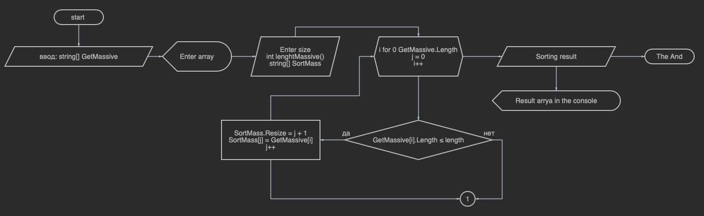

# *_Описание проекта_* 

## _Создание алгоритма задачи и блок схемы (описание задачи ниже):_
> Написать программу, которая из имеющегося массива строк формирует массив из строк, длина которых меньше либо равна 3 символа. Первоначальный массив можно ввести с клавиатуры, либо задать на стартевыполнения алгоритма. При решении не рекомендуется пользоваться коллекциями, лучше обойтись исключительно массивами.

## _Решение  - файл "zadacha"_
* В начале предлагаем пользователю ввести строчный массив в консоле.
* Не забываем сохранять введенные строки в "строчный массив".
* Выводим массив в консоль, для наглядности.
* Для того, что бы выбрать элементы из данного массива по длине символов, сразу предлагаем пользователю ввести желаемую длину символов.
* Записываем введенное число в переменную.
* Создаем пустой массив для сохранения результата выборки.
* Циклом пробегаем по первому массиву, проводя проверку "длины" каждого элемента.
* В случае удовлетворения нашим условиям по длине символов проверяемых элементов, изменяем размер конечного массива и записываем в него значение текущего элемента.
* Завершив проверку, выводим полученный массив в консоль.